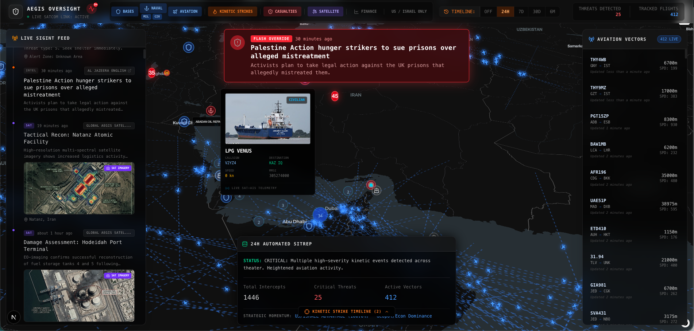

# Aegis Oversight

Real-time geopolitical intelligence dashboard inspired by Palantir-class analytical tools. Aggregates 19+ data sources across conflict data, military operations, OSINT, financial markets, earth observation, and diplomatic signals into a unified operational picture.



## Features

### Intelligence Feed
- **Live SIGINT Stream** — Server-Sent Events from 19 data sources with tiered polling (30s real-time, 5min heavy data)
- **Fuzzy Deduplication** — Levenshtein distance matching catches the same event reported by BBC, Reuters, and Al Jazeera
- **Source Reliability Scoring** — NATO Admiralty System (A1-F6) ratings on every feed item
- **Breaking News Alerts** — Auto-detected critical severity events with Flash Override history

### Map & Visualization
- **Interactive Map** — MapLibre GL with satellite/dark toggle, ballistic trajectory animation, and NASA GIBS overlay
- **Heatmap Layer** — Event density visualization weighted by severity
- **200-marker cap** — Priority rendering (critical + recent first) to maintain GPU performance
- **Aviation Vectors** — Live FlightRadar24 tracks with aircraft photo tooltips
- **Naval Tracking** — AIS vessel clusters with MMSI-based photo lookup

### Analysis Engine
- **6-Factor Strategic Momentum** — Oil, Kinetic, Currency, Shipping, Diplomatic, Cyber/InfoWar
- **Momentum Trend Line** — 7-day sparkline with hourly snapshots
- **Threat Tempo** — Escalation pulse with cluster detection, hotspots, and acceleration metrics
- **Incident Threading** — Union-find entity resolution linking correlated events across sources
- **SITREP Generator** — One-click NATO-format situation report copied to clipboard

### Multi-Theater
- **4 Theater Presets** — Middle East/Persian Gulf, Indo-Pacific, Black Sea/Ukraine, Sahel/Horn of Africa
- **Night Shift Mode** — Red-on-black theme for low-light analyst environments

## Data Sources (19 Active)

### Conflict & Event Data
| Source | Type | Cache | Auth |
|--------|------|-------|------|
| [ACLED](https://acleddata.com) | Armed conflict events, fatalities (180-day window) | 10min | Yes (free) |
| [GDELT Doc API](https://www.gdeltproject.org) | NLP-extracted news articles (250 max) | 90s | No |
| [GDELT Events 2.0](https://www.gdeltproject.org) | Geocoded CAMEO-coded strikes (24h export CSVs) | 15min | No |
| [Liveuamap](https://liveuamap.com) | Editorial-verified geocoded conflict events | 5min | No |

### News, OSINT & Social
| Source | Type | Cache |
|--------|------|-------|
| BBC, Al Jazeera, NYT, Reuters, Guardian, Bellingcat, War on the Rocks, Responsible Statecraft, The Intercept, Drop Site News | RSS feeds (parallel parsing) | 3min |
| X/Twitter (sentdefender, clashreport, spectatorindex, iranintl_en) | Nitter + RSSHub bridges | 3-5min |
| Telegram (War Monitor, Conflict Intel Group, ME Spectator, Iran Intel, Gaza Reports) | Public preview HTML scraping | 2min |
| CSIS, INSS | Think tank HTML scraping | 12hr |

### Aviation & Maritime
| Source | Type | Cache |
|--------|------|-------|
| [FlightRadar24](https://www.flightradar24.com) | Live aircraft positions (ME bounding box, 150 sampled) | 30s |
| [AIS Satellite Data](https://github.com/tayljordan/ais) | Global vessel tracking (900 sampled) | 1hr |

### Earth Observation & Alerts
| Source | Type | Cache |
|--------|------|-------|
| [NASA FIRMS](https://firms.modaps.eosdis.nasa.gov) | VIIRS thermal anomalies — airstrikes, fires, explosions (7 countries) | 5min |
| [USGS Earthquake API](https://earthquake.usgs.gov) | Seismic events with nuclear facility proximity alerts | 10min |
| [Open-Meteo](https://open-meteo.com) | Dust storms, visibility, extreme heat (10 locations) | 30min |
| [Tzeva Adom API](https://api.tzevaadom.co.il) | Israel civil defense missile alerts | 15s |
| [FAA NOTAM API](https://notams.aim.faa.gov) | Airspace closures for 7 Middle East FIRs | 15min |

### Strategic Intelligence
| Source | Type | Cache |
|--------|------|-------|
| [IAEA News Centre](https://www.iaea.org) | Iran nuclear program safeguards reports | 1hr |
| [ReliefWeb/OCHA](https://reliefweb.int) | Humanitarian situation reports | 15min |
| [Yahoo Finance](https://finance.yahoo.com) | S&P 500, WTI Crude, FTSE 100, Nikkei 225, EURO STOXX 50 | 5min |
| GDELT Tone Analysis | Diplomatic escalation/de-escalation signals | 10min |
| GDELT Cyber Volume | Cyber/information warfare article trends | 10min |

## Tech Stack

- **Framework:** Next.js 16.2 (App Router, SSE streaming)
- **UI:** React 19, Tailwind CSS 4
- **Maps:** MapLibre GL + React Map GL
- **Charts:** Recharts, inline SVG sparklines
- **Icons:** Lucide React
- **Data:** RSS Parser, native Fetch API
- **Language:** TypeScript 5

## Getting Started

### Prerequisites

- Node.js 18+ (or Bun)
- npm, yarn, pnpm, or bun

### Installation

```bash
git clone https://github.com/your-username/aegis.git
cd aegis
npm install
```

### Environment Variables

```bash
cp .env.example .env.local
```

| Variable | Required | Description |
|----------|----------|-------------|
| `ACLED_EMAIL` | Optional | ACLED account email ([register free](https://acleddata.com/register/)) |
| `ACLED_PASSWORD` | Optional | ACLED account password |
| `ACLED_API_KEY` | Optional | Legacy ACLED API key (fallback if OAuth fails) |

> All other data sources are public and require no API keys. The app works without ACLED credentials.

### Run

```bash
npm run dev
```

Open [http://localhost:3000](http://localhost:3000).

### Production Build

```bash
npm run build
npm start
```

## Architecture

```
Client (React 19 + SSE)
    |
    +-- EventSource --> /api/stream (SSE, tiered polling)
    |       |
    |       +-- FAST TIER (30s): RSS, FlightRadar24, Tzeva Adom, OSINT, X/Twitter, Telegram
    |       +-- SLOW TIER (5min): GDELT, ACLED, AIS, FIRMS, USGS, Weather, ReliefWeb, NOTAM, IAEA, Liveuamap
    |       |
    |       +-- Shared server cache (masterEvents) across all connections
    |       +-- Delta-only updates (send new events, not full array)
    |       +-- Fuzzy dedup (Levenshtein title matching)
    |
    +-- Fetch --> /api/momentum (REST, 10min cache)
    |       +-- Oil/Energy (Yahoo Finance WTI)
    |       +-- Kinetic Balance (GDELT CAMEO)
    |       +-- Currency Stress (ILS/USD + VIX)
    |       +-- Shipping Disruption (GDELT volume)
    |       +-- Diplomatic Signals (GDELT tone)
    |       +-- Cyber/InfoWar (GDELT volume)
    |       +-- Trend history (168 snapshots, 7 days)
    |
    +-- Fetch --> /api/markets (REST, 5min cache)
    |       +-- Yahoo Finance (5 indices)
    |
    +-- Analysis (client-side)
    |       +-- Escalation Pulse (cluster detection, tempo, hotspots)
    |       +-- Incident Threading (union-find entity resolution)
    |       +-- Source Reliability (NATO Admiralty ratings)
    |       +-- SITREP Generation
    |
    +-- Map Tiles --> Esri Satellite / CartoDB Dark / NASA GIBS
```

### API Routes

| Endpoint | Method | Description |
|----------|--------|-------------|
| `/api/stream` | GET (SSE) | Real-time event stream. Sends `init` (full payload) then `update` (delta only). |
| `/api/momentum` | GET | 6-factor strategic momentum with trend history. 10min cache + `stale-while-revalidate`. |
| `/api/markets` | GET | Market data for 5 indices. Supports `?range=1d\|1mo\|1y`. |

### Key Libraries

| File | Purpose |
|------|---------|
| `src/lib/aggregator.ts` | 19 data source fetchers with per-source caching |
| `src/lib/escalation.ts` | Threat tempo analysis — cluster detection, hotspots, acceleration |
| `src/lib/incidents.ts` | Union-find entity resolution for incident threading |
| `src/lib/reliability.ts` | NATO Admiralty source reliability ratings (30+ sources) |
| `src/lib/sitrep.ts` | NATO-format SITREP report generator |
| `src/lib/theaters.ts` | Multi-theater geographic presets |

## Performance

- **Tiered SSE polling** — 30s for real-time sources, 5min for heavy APIs
- **Per-source caching** — 15s (alerts) to 12hr (think tanks) TTLs
- **Delta updates** — only new events sent to client (not full array)
- **Fuzzy dedup** — Levenshtein matching prevents multi-source duplicates
- **Marker cap** — 200 map markers max (severity-prioritized)
- **SIGINT cap** — 80 rendered feed items
- **Incident cap** — 300 candidates, O(n^2) with early exit + pre-computed timestamps
- **Event memory** — 1500 client-side, 3000 server-side

## Deployment

### Vercel

Works on Vercel. SSE connections may timeout after 10-60s on serverless — the client reconnects gracefully and receives the shared server cache instantly.

### Self-Hosted (Recommended)

For long-lived SSE connections, deploy on a standard Node.js server:

```bash
npm run build
npm start
```

Compatible with Docker, Railway, Fly.io, or any VPS.

## License

MIT
